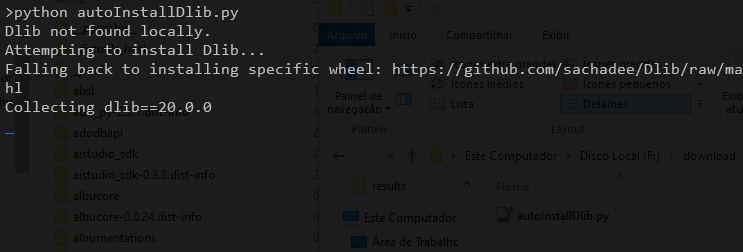
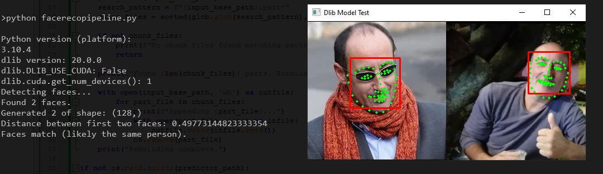
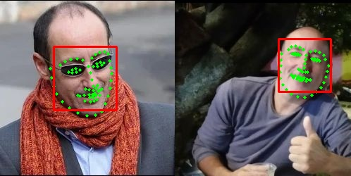

# Dlib compiled wheels for Python 3.7 to 3.15 for Windows X64
Dlib compiled binary (.whl) for python 3.7 to 3.15 for windows x64

After wasting a lot of time to get these files, I compiled them myself.

### A Bonus recognition pipeline is available at the end of this file:

[Link to the BONUS section with full recognition pipeline with Dlib](#BONUS)

## Installation:
You can download and use the autoInstall script:
it will automatically detect your python version, check if dlib is already installed if not it will download the right wheel from this repo and install it:

 [Auto Install Dlib](./util/autoInstallDlib.py)



### solution 1:

PIP direct from Github :

```
pip install https://github.com/sachadee/Dlib/raw/main/wheel_for_your_python_version.whl
```
Example:

```
python -m pip install https://github.com/sachadee/Dlib/raw/main/dlib-20.0.0-cp310-cp310-win_amd64.whl
```

### solution 2 (Downloading the wheel):

1- Download the file you need

2- copy it in the root folder of your python distribuition

3- open a cmd shell in the your root python folder 

example:
```
cd c:\python37
```

4- Install DLIB true PIP

### python 3.7
```
python -m pip install dlib-20.0.0-cp37-cp37-win_amd64.whl 
```

### python 3.8
```
python -m pip install dlib-20.0.0-cp38-cp38-win_amd64.whl
```
### python 3.9
```
python -m pip install dlib-20.0.0-cp39-cp39-win_amd64.whl
```
### python 3.10
```
python -m pip install dlib-20.0.0-cp310-cp310-win_amd64.whl
```
### python 3.11
```
python -m pip install dlib-20.0.0-cp311-cp311-win_amd64.whl
```
### python 3.12
```
python -m pip install dlib-20.0.0-cp312-cp312-win_amd64.whl
```
### python 3.13
```
python -m pip install dlib-20.0.0-cp313-cp313-win_amd64.whl
```
### python 3.14
```
python -m pip install dlib-20.0.0-cp314-cp314-win_amd64.whl
```
### python 3.15
```
python -m pip install dlib-20.0.0-cp315-cp315-win_amd64.whl
```
## BONUS:

### Full recognition pipeline  to test dlib:

Python code to detect/recognize from an image :

 [Detect or Recognize code](./dlibTest/FaceRecoPipeline.py)

 for detection only you can test with the image :

 

 for recognition:


The result in the console: between the 2 faces detected in th image:

 


you will get also 2 images in the results dir:
 
 
 and
 

##That's it

